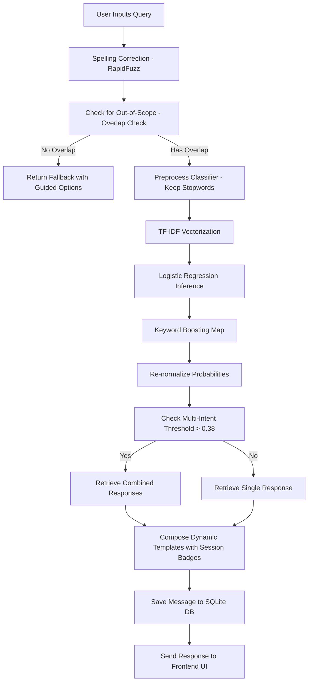

# CHAPTER 13: SYSTEM ANALYSIS

## 13.1 Requirement Gathering

The development of **HealthFit AI** began with a detailed requirement gathering process. This involved studying how users seek wellness information and the standard features of modern chat tools. The requirement gathering steps included:
1. **Target Audience Analysis**: Identifying that users range from fitness beginners (who need simple exercise forms and basic guidelines) to active gym-goers (seeking macro profiles and protein breakdowns).
2. **Feature Mapping**: Establishing that a conversational interface combined with dynamic badges showing physical metrics (height, weight, goal) is highly effective for visual feedback.
3. **Database Audit Needs**: Determining that all user inputs, chatbot classifications, confidence levels, and feedback ratings must be logged to a database to enable offline analysis and system refinement.

## 13.2 Workflows and Usecase Modelling

To map the interactions between the User and the chatbot system, Use Case modeling is used. The primary actor is the **User**, and the secondary actor is the **System Administrator** (who audits the database logs and triggers model retraining).

### Use Case Diagram (Mermaid)

```mermaid
usecaseDiagram
    actor User as "User"
    actor Admin as "Administrator"

    package "HealthFit AI Chatbot System" {
        usecase UC1 as "Send Message"
        usecase UC2 as "View Chat History"
        usecase UC3 as "Perform Fitness Calculations"
        usecase UC4 as "Submit Feedback (👍/👎)"
        usecase UC5 as "Manage Chat Sessions"
        usecase UC6 as "Audit Feedback & Logs"
        usecase UC7 as "Trigger Model Retraining"
    }

    User --> UC1
    User --> UC2
    User --> UC3
    User --> UC4
    User --> UC5

    Admin --> UC6
    Admin --> UC7
```

### System Workflows

The message processing workflow details what happens behind the scenes from the moment the user presses the "Send" button:


