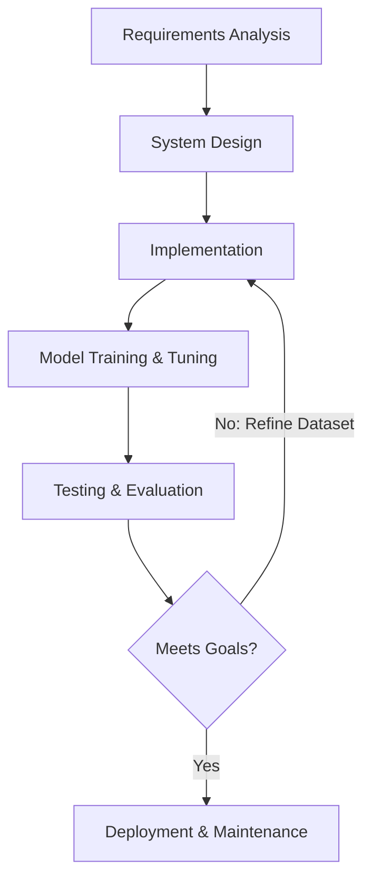

# CHAPTER 15: SOFTWARE DEVELOPMENT LIFE CYCLE (SDLC)

## 15.1 Choice of SDLC Model (Iterative Waterfall)

For the development of **HealthFit AI**, the **Iterative Waterfall Model** was selected. This model combines the structured discipline of the classic Waterfall lifecycle with the flexibility of iterative cycles, which is highly beneficial when developing machine learning projects. 

Traditional waterfall is too rigid for classification systems, as dataset patterns and intent boundary overlaps are often discovered only after initial model evaluation. The iterative variation allowed the development team to freeze core stages (like database schemas and frontend UI structures) while repeating the data modeling and preprocessor tuning stages to optimize validation accuracy.

## 15.2 Phase-wise Implementation

The project progressed through six distinct phases:

### Phase 1: Requirements Gathering & Analysis
- Conducted surveys on common user fitness queries.
- Formulated the list of 34 target intents (greetings, exercises, meal planners, calculation tools).
- Documented hardware and software constraints in the SRS.

### Phase 2: System Design
- Drafted database schemas for logging chat messages, sessions, and user feedback.
- Designed system workflows, use-case models, and entity-relationship models.
- Structured the file directory into an MVC-inspired configuration.

### Phase 3: Core Implementation
- Developed the Python Flask server endpoints (`/api/chat`, `/api/feedback`, `/api/history`).
- Built the frontend user interface using HTML5, Bootstrap 5, and JavaScript.
- Initialized local SQLite tables using a database manager module.

### Phase 4: NLP Pipeline Modeling
- Wrote a dataset compilation script (`generate_intents.py`) to compile 2,550 high-quality balanced patterns.
- Programmed dual text preprocessing pipelines (`preprocess_classifier` and `preprocess_keywords`).
- Trained the statistical Logistic Regression model and saved the Joblib artifacts.

### Phase 5: Verification and Refinement (Iterative Cycles)
- Ran integration tests (`test_nlp.py`) verifying session memory, intent aliases, and follow-up inheritance.
- Fixed synonym collisions by adding specific blacklists (e.g., preventing "mass" and "strength" from mapping to "bulk" or "muscle").
- Tuned inverse regularization parameters ($C=1.0$) and implemented keyword-matching refinements to resolve out-of-scope queries.

### Phase 6: System Evaluation & Deployment
- Evaluated the final engine across 210 unseen test queries, recording **74.76% overall accuracy**.
- Documented performance metrics and compiled the final project submission reports.
