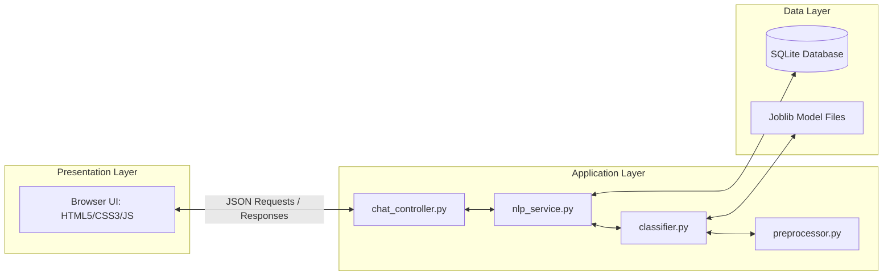
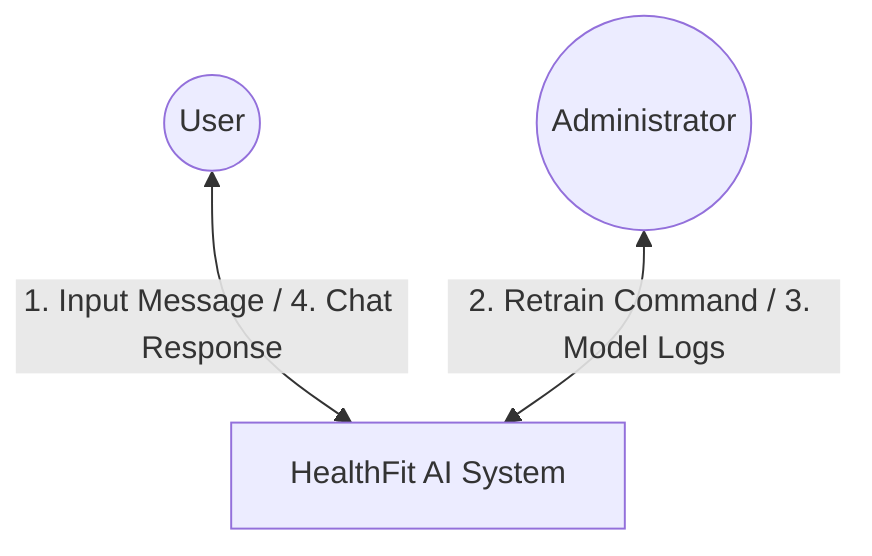
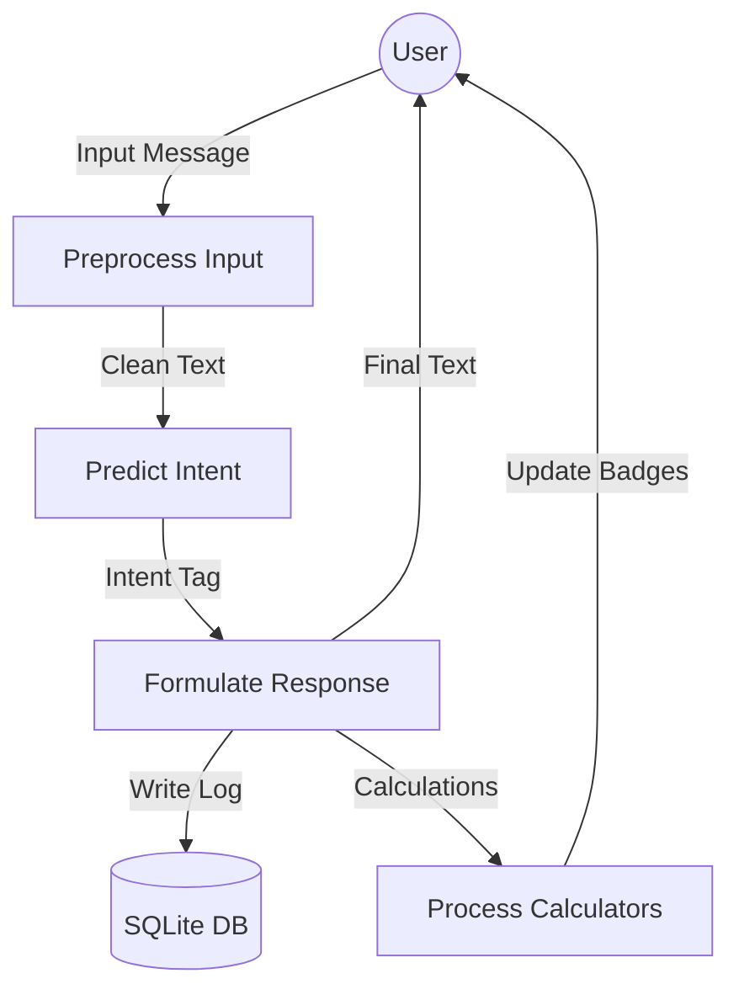
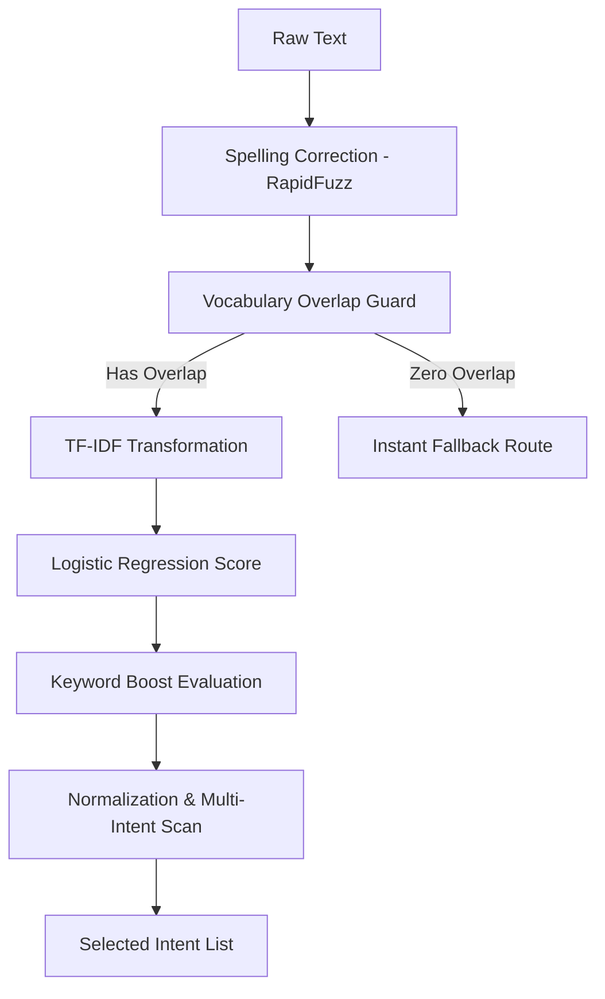
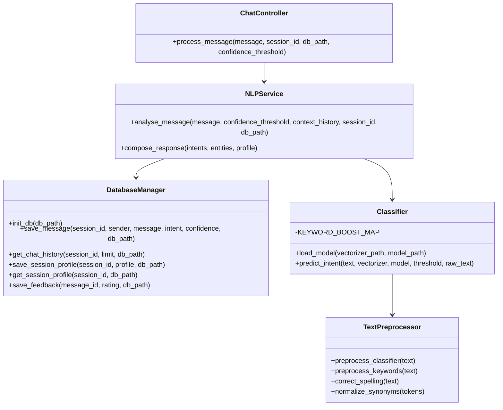
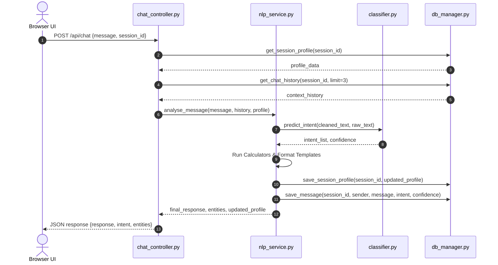

# CHAPTER 16: SYSTEM DESIGN

System design translates logical requirements into a structured, executable software model. This chapter presents the architectural design, Data Flow Diagrams (DFD), and UML class and sequence diagrams for **HealthFit AI**.

## 16.1 System Architecture

The architecture of HealthFit AI separates concerns into three distinct layers:
1. **Presentation Layer (Frontend UI)**: Handles user interaction, manages local session states, displays dynamic badges, and formats bot responses.
2. **Application Layer (Flask Controller & NLP Services)**: Manages API routes, executes preprocessing pipelines, evaluates ML classifications, and merges multi-intent templates.
3. **Data Persistence Layer (SQLite Database & Model Files)**: Persists session metrics, feedback audits, chat transcripts, and houses the static pre-trained Joblib model files.

## 16.2 Data Flow Diagrams (DFD)

Data Flow Diagrams track how data moves through the system.

### DFD Level 0 (Context Level Diagram)

### DFD Level 1 (Operational DFD)

### DFD Level 2 (NLP Classification Details)

## 16.3 UML Diagrams

UML diagrams model structural class relationships and chronological service messaging sequences.

### UML Class Diagram

### UML Sequence Diagram (Message Request)

