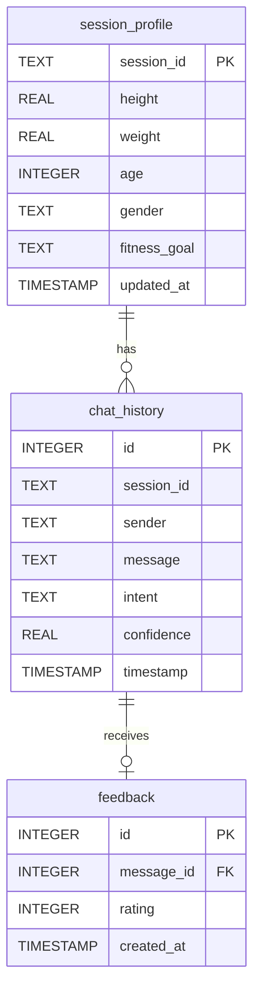

# CHAPTER 17: DATABASE DESIGN

## 17.1 Entity Relationship (ER) Diagram

The database for **HealthFit AI** is implemented using SQLite 3. It consists of three primary tables: `chat_history` (stores conversational turns), `session_profile` (retains user physical metrics for calculations), and `feedback` (logs user satisfaction upvotes/downvotes).



## 17.2 Schema Descriptions & Tables

The SQLite schemas for each table are detailed below:

### 1. `chat_history` Table
Stores chronological message transcripts of the conversational assistant.

| Column Name | Data Type | Constraints | Description |
| :--- | :--- | :--- | :--- |
| `id` | INTEGER | PRIMARY KEY AUTOINCREMENT | Unique identifier for each chat turn. |
| `session_id` | TEXT | NOT NULL | UUID grouping messages within a specific chat session. |
| `sender` | TEXT | NOT NULL | Identifies message source: `'user'` or `'bot'`. |
| `message` | TEXT | NOT NULL | Raw textual input typed by the user or response sent by the bot. |
| `intent` | TEXT | NULLABLE | Classified intent tag or joint tags (e.g., `bmi+hydration`). |
| `confidence` | REAL | NULLABLE | Classification probability score from the classifier model. |
| `timestamp` | TIMESTAMP | DEFAULT CURRENT_TIMESTAMP | Date and time the message was logged. |

*SQLite Table Creation SQL*:
```sql
CREATE TABLE IF NOT EXISTS chat_history (
    id INTEGER PRIMARY KEY AUTOINCREMENT,
    session_id TEXT NOT NULL,
    sender TEXT NOT NULL,
    message TEXT NOT NULL,
    intent TEXT,
    confidence REAL,
    timestamp DATETIME DEFAULT CURRENT_TIMESTAMP
);
```

### 2. `session_profile` Table
Stores persisted physical parameters and goals for session-based mathematical estimation.

| Column Name | Data Type | Constraints | Description |
| :--- | :--- | :--- | :--- |
| `session_id` | TEXT | PRIMARY KEY | Unique identifier mapped to the user session. |
| `height` | REAL | NULLABLE | User height in centimeters. |
| `weight` | REAL | NULLABLE | User weight in kilograms. |
| `age` | INTEGER | NULLABLE | User age in years. |
| `gender` | TEXT | NULLABLE | User biological gender (e.g., `'male'`, `'female'`). |
| `fitness_goal` | TEXT | NULLABLE | User fitness target (e.g., `'weight loss'`, `'muscle gain'`). |
| `updated_at` | DATETIME | DEFAULT CURRENT_TIMESTAMP | Timestamp indicating last update profile turn. |

*SQLite Table Creation SQL*:
```sql
CREATE TABLE IF NOT EXISTS session_profile (
    session_id TEXT PRIMARY KEY,
    height REAL,
    weight REAL,
    age INTEGER,
    gender TEXT,
    fitness_goal TEXT,
    updated_at DATETIME DEFAULT CURRENT_TIMESTAMP
);
```

### 3. `feedback` Table
Records upvotes and downvotes to audit responses and identify errors.

| Column Name | Data Type | Constraints | Description |
| :--- | :--- | :--- | :--- |
| `id` | INTEGER | PRIMARY KEY AUTOINCREMENT | Unique row identifier. |
| `message_id` | INTEGER | FOREIGN KEY REFERENCES `chat_history(id)` | Identifies the specific bot response receiving feedback. |
| `rating` | INTEGER | CHECK (`rating` IN (1, -1)) | `1` represents an Upvote (👍), `-1` represents a Downvote (👎). |
| `created_at` | DATETIME | DEFAULT CURRENT_TIMESTAMP | Date and time feedback was logged. |

*SQLite Table Creation SQL*:
```sql
CREATE TABLE IF NOT EXISTS feedback (
    id INTEGER PRIMARY KEY AUTOINCREMENT,
    message_id INTEGER NOT NULL,
    rating INTEGER CHECK(rating IN (1, -1)),
    created_at DATETIME DEFAULT CURRENT_TIMESTAMP,
    FOREIGN KEY(message_id) REFERENCES chat_history(id) ON DELETE CASCADE
);
```
