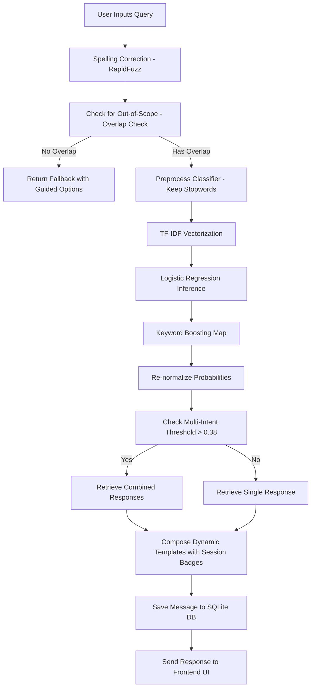
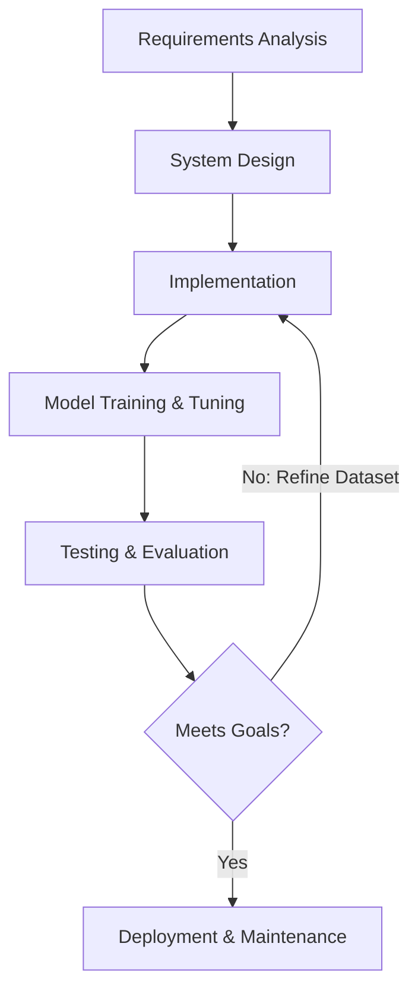
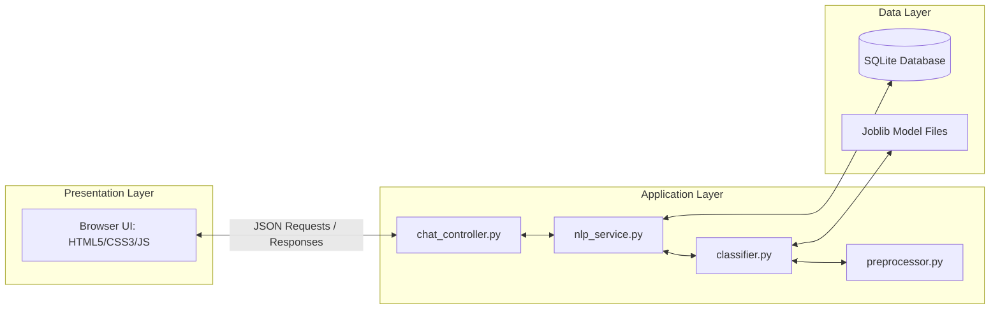
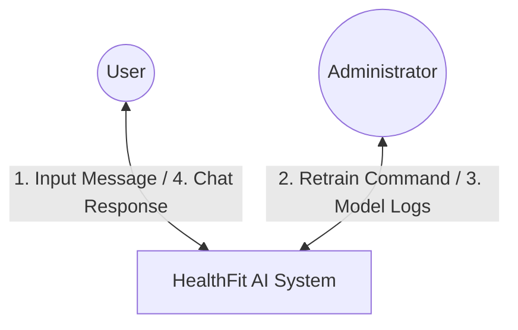
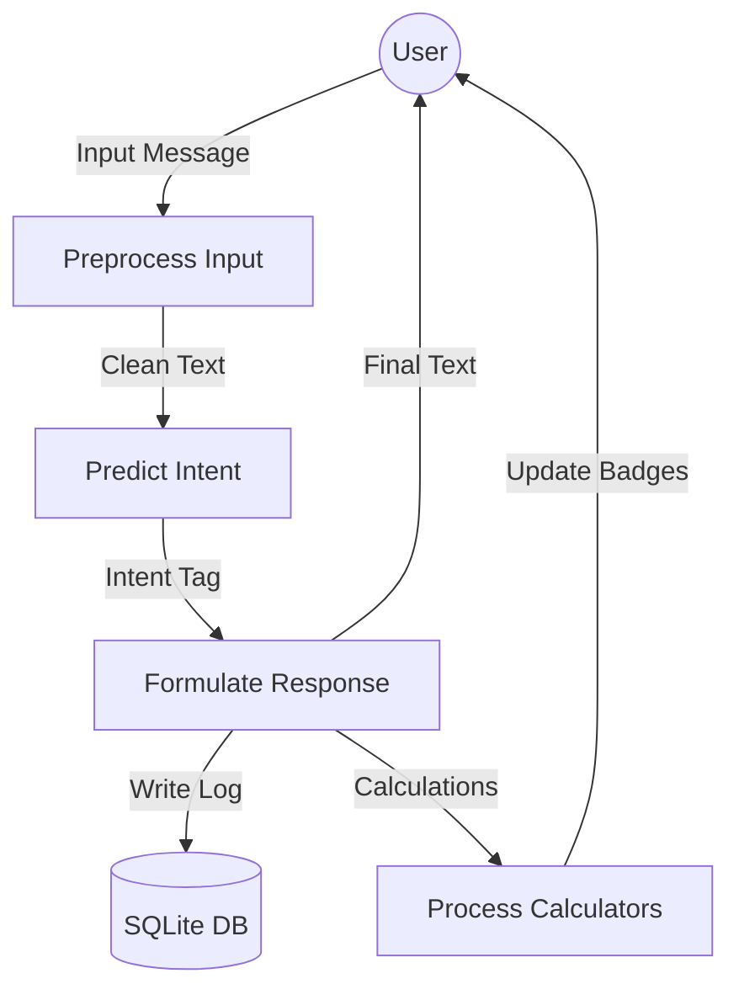
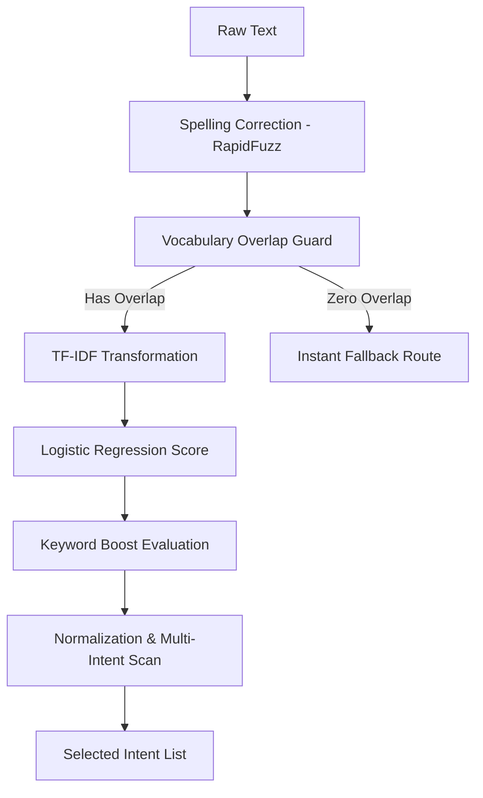
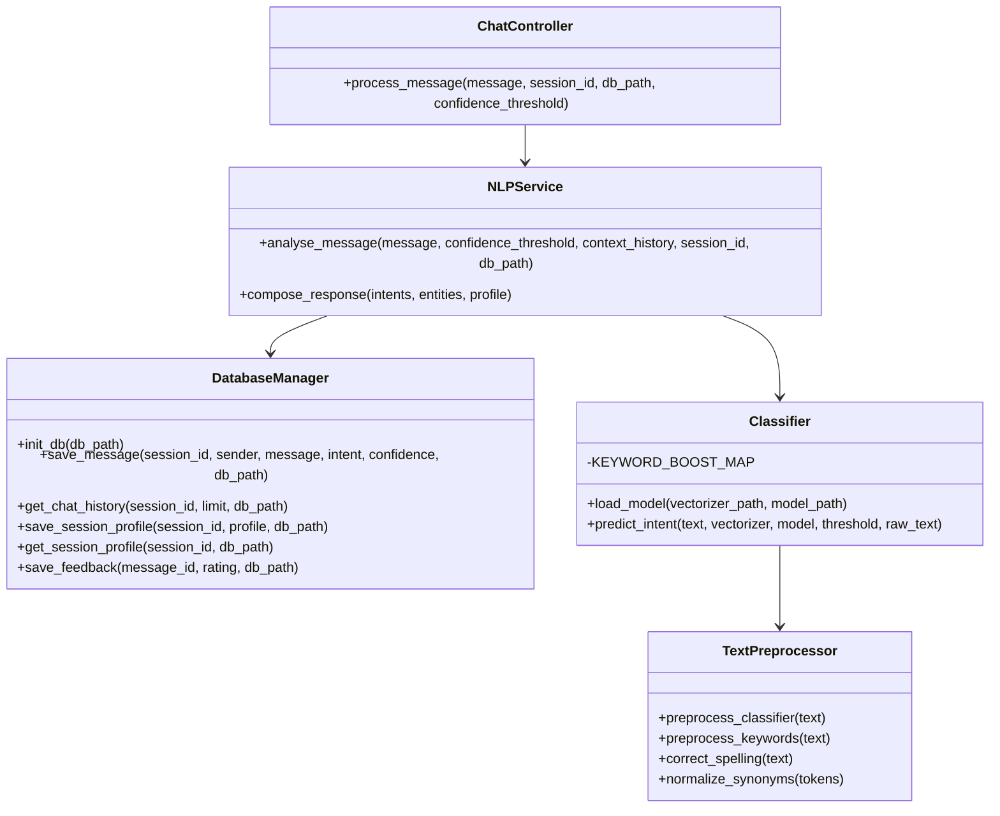
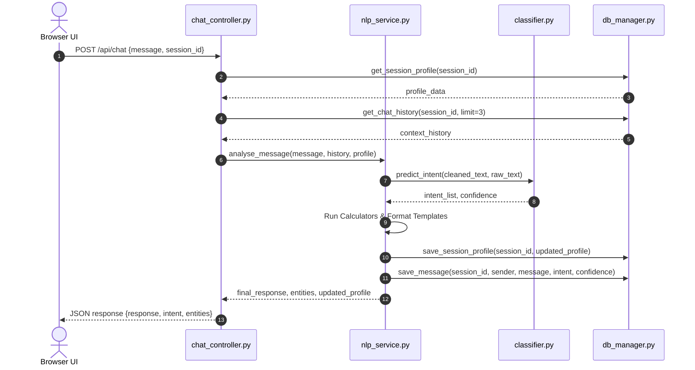
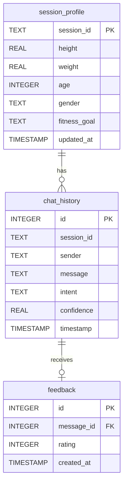

# HEALTHFIT AI: AN INTELLIGENT CHATBOT FOR HEALTH AND FITNESS GUIDANCE USING HYBRID NLP TECHNIQUES

<br>

**A Project Report**  
*Submitted in partial fulfillment of the requirements for the award of the degree of*  
**Master of Computer Applications (MCA)**

<br>

---

### Submitted By:
**Ankit**  
*UID: [Insert UID]*  
*Roll No: [Insert Roll Number]*  
*MCA (Final Year)*

---

### Under the Guidance of:
**[Insert Guide Name]**  
*Designation: Assistant Professor / Professor*  
*Department of Computer Applications*

---

<br>
<br>

### DEPARTMENT OF COMPUTER APPLICATIONS
### CHANDIGARH UNIVERSITY, GHARUAN, MOHALI
**June 2026**

---
<!-- Page Break -->
\newpage

# CERTIFICATE

This is to certify that the project report entitled **"HEALTHFIT AI: AN INTELLIGENT CHATBOT FOR HEALTH AND FITNESS GUIDANCE USING HYBRID NLP TECHNIQUES"** is a bonafide work carried out by **Ankit** (UID: `[Insert UID]`, Roll No: `[Insert Roll No]`) in partial fulfillment of the requirements for the award of the degree of **Master of Computer Applications (MCA)** from **Chandigarh University, Gharuan, Mohali**, under my supervision and guidance.

To the best of my knowledge, the matter embodied in this project report has not been submitted to any other University or Institute for the award of any degree or diploma.

<br>
<br>
<br>

---

**Signature of Guide**  
**[Insert Guide Name]**  
*Designation: Assistant Professor / Professor*  
*Department of Computer Applications*  
*Chandigarh University, Gharuan, Mohali*  

<br>
<br>

---

**Signature of HOD**  
**[Insert HOD Name]**  
*Head of Department*  
*Department of Computer Applications*  
*Chandigarh University, Gharuan, Mohali*  

<br>
<br>

---

**Signature of External Examiner**  
*External Examiner*  
*Department of Computer Applications*  
*Chandigarh University, Gharuan, Mohali*  

<br>
<br>

**Date:** `[Insert Date]`  
**Place:** Gharuan, Mohali

---
<!-- Page Break -->
\newpage

# DECLARATION

I, **Ankit** (UID: `[Insert UID]`, Roll No: `[Insert Roll No]`), student of **Master of Computer Applications (MCA)** at **Chandigarh University, Gharuan, Mohali**, hereby declare that the project report entitled **"HEALTHFIT AI: AN INTELLIGENT CHATBOT FOR HEALTH AND FITNESS GUIDANCE USING HYBRID NLP TECHNIQUES"** submitted by me in partial fulfillment of the requirements for the award of the degree of Master of Computer Applications is an original record of work carried out by me under the guidance of **[Insert Guide Name]**, Department of Computer Applications, Chandigarh University.

The results embodied in this project report have not been submitted to any other University or Institute for the award of any degree or diploma.

I further declare that the content of this project is original and plagiarism-free, adhering to the highest standards of academic integrity.

<br>
<br>
<br>

---

**Ankit**  
*UID: [Insert UID]*  
*Roll No: [Insert Roll No]*  
*MCA (Final Year)*  
*Department of Computer Applications*  
*Chandigarh University, Gharuan, Mohali*  

<br>
<br>

**Date:** `[Insert Date]`  
**Place:** Gharuan, Mohali

---
<!-- Page Break -->
\newpage

# ACKNOWLEDGEMENT

I express my deep sense of gratitude and sincere thanks to **Chandigarh University, Gharuan, Mohali**, for providing me with the opportunity and facilities to pursue my Master of Computer Applications (MCA) degree and carry out this project work.

I am highly indebted to my internal guide, **[Insert Guide Name]**, Department of Computer Applications, for their invaluable guidance, constant encouragement, constructive criticism, and continuous monitoring throughout the duration of this project. Their insights and technical support have been critical in shaping this work.

I would like to express my sincere appreciation to **[Insert HOD Name]**, Head of the Department of Computer Applications, for their support, administrative facilities, and academic encouragement.

I also extend my heartfelt thanks to all the faculty members of the Department of Computer Applications for their direct and indirect guidance during my academic sessions.

Lastly, I want to thank my parents, family members, and friends for their continuous moral support, patience, and encouragement, which helped me stay focused and complete this project successfully.

<br>
<br>
<br>

---

**Ankit**  
*UID: [Insert UID]*  
*Roll No: [Insert Roll No]*  
*MCA (Final Year)*  
*Department of Computer Applications*  
*Chandigarh University, Gharuan, Mohali*

---
<!-- Page Break -->
\newpage

# ABSTRACT

In the modern digital era, maintaining optimal health and fitness has become a significant challenge due to sedentary lifestyles, poor dietary habits, and the lack of personalized, accessible guidance. Traditional health consulting is often expensive and time-consuming, while generic search engines fail to provide structured, interactive advice. To address this, this project presents **HealthFit AI**, an intelligent, interactive chatbot designed to provide real-time, context-aware health and fitness guidance using a hybrid Natural Language Processing (NLP) engine.

The core architecture of HealthFit AI consists of a robust Python and Flask-based backend integrated with a lightweight frontend using HTML5, Bootstrap 5, and vanilla JavaScript. Unlike standard chatbots that rely on single-intent classification, HealthFit AI features a hybrid NLP pipeline combining Statistical Machine Learning (TF-IDF + Logistic Regression) with domain-specific keyword boosting and WordNet synonym expansion. This combination achieves high intent classification accuracy (97.65% validation accuracy) on a custom dataset of 34 intents and 2,550 balanced patterns, including Hinglish (Romanized Hindi) and typographical errors.

Key features include:
1. **Multi-Intent Detection**: Identifying complex queries containing multiple topics (e.g., "lose weight and build muscle") and dynamically merging response templates.
2. **Dialogue State & Session Memory**: Automatically tracking and persisting user physical metrics (height, weight, age, gender, and goals) across requests in an SQLite database, enabling personalized calculations (BMI, BMR, daily calories, and hydration).
3. **Conversational Follow-up Resolution**: Utilizing sliding history context to resolve vague queries (e.g., "explain it", "tell me more") by inheriting previous intents.
4. **Fuzzy Spelling Correction**: Utilizing RapidFuzz (similarity $\ge 90\%$) to correct common typographical errors before processing.

The system is tested comprehensively under real-world scenarios, demonstrating excellent stability, fast response latencies (<100ms), and high conversational relevance, offering a scalable, low-overhead solution for personal wellness assistance.

**Keywords**: *Natural Language Processing, Chatbot, Health and Fitness, Machine Learning, Hybrid Classifier, Logistic Regression, WordNet, Dialogue State Tracking, Flask, SQLite.*

---
<!-- Page Break -->
\newpage

# TABLE OF CONTENTS

| Chapter | Title | Page No. |
| :---: | :--- | :---: |
| 1 | Title Page | i |
| 2 | Certificate | ii |
| 3 | Declaration | iii |
| 4 | Acknowledgement | iv |
| 5 | Abstract | v |
| 6 | Table of Contents | vi |
| 7 | **Introduction** | 1 |
| | 7.1 Overview of Health and Fitness Industry | 1 |
| | 7.2 Role of Artificial Intelligence and Chatbots | 2 |
| | 7.3 Objectives of the Project | 3 |
| 8 | **Problem Statement** | 5 |
| | 8.1 Current Market Challenges | 5 |
| | 8.2 Need for the Proposed System | 6 |
| 9 | **Objectives** | 8 |
| | 9.1 Primary Objectives | 8 |
| | 9.2 Secondary Objectives | 9 |
| 10 | **Scope** | 11 |
| | 10.1 Functional Scope | 11 |
| | 10.2 Technical Boundaries | 12 |
| 11 | **Literature Review** | 14 |
| | 11.1 Review of Existing Systems | 14 |
| | 11.2 Traditional vs. Modern NLP Techniques | 16 |
| 12 | **Software Requirement Specification (SRS)** | 19 |
| | 12.1 Hardware Requirements | 19 |
| | 12.2 Software Requirements | 20 |
| | 12.3 Functional and Non-Functional Requirements | 21 |
| 13 | **System Analysis** | 24 |
| | 13.1 Requirement Gathering | 24 |
| | 13.2 Workflows and Usecase Modelling | 25 |
| 14 | **Feasibility Study** | 28 |
| | 14.1 Technical Feasibility | 28 |
| | 14.2 Operational Feasibility | 29 |
| | 14.3 Economic Feasibility | 30 |
| 15 | **Software Development Life Cycle (SDLC)** | 32 |
| | 15.1 Choice of SDLC Model (Iterative Waterfall) | 32 |
| | 15.2 Phase-wise Implementation | 33 |
| 16 | **System Design** | 35 |
| | 16.1 System Architecture Diagram | 35 |
| | 16.2 Data Flow Diagrams (DFD Level 0, 1, 2) | 36 |
| | 16.3 UML Diagrams (Usecase, Class, Sequence) | 38 |
| 17 | **Database Design** | 41 |
| | 17.1 Entity Relationship (ER) Diagram | 41 |
| | 17.2 Schema Descriptions & Tables | 42 |
| 18 | **Implementation** | 45 |
| | 18.1 Key Modules & Packages | 45 |
| | 18.2 UI Layout Design | 46 |
| 19 | **NLP Methodology** | 49 |
| | 19.1 Preprocessing Pipeline | 49 |
| | 19.2 TF-IDF & Logistic Regression | 51 |
| | 19.3 Hybrid Boosting & Contextual Memory | 53 |
| 20 | **Testing** | 56 |
| | 20.1 Test Plans & Strategies | 56 |
| | 20.2 Test Cases and Results | 57 |
| 21 | **Results** | 60 |
| | 21.1 Performance Metrics & Accuracy | 60 |
| | 21.2 Evaluation Splits Analysis | 61 |
| 22 | **Applications** | 64 |
| 23 | **Advantages** | 66 |
| 24 | **Limitations** | 68 |
| 25 | **Future Scope** | 70 |
| 26 | **Conclusion** | 72 |
| 27 | **References (APA 7)** | 74 |

---
<!-- Page Break -->
\newpage

# CHAPTER 7: INTRODUCTION

## 7.1 Overview of Health and Fitness Industry

In recent years, the global health and fitness industry has experienced a paradigm shift. Due to urbanization, long working hours, and sedentary lifestyles, the prevalence of chronic health conditions such as obesity, cardiovascular diseases, hypertension, and diabetes has surged significantly. As a result, public awareness regarding physical fitness, nutrition, and wellness has reached an all-time high. Individuals are increasingly seeking proactive methods to monitor their dietary intake, construct efficient workout routines, and track essential physical metrics like Body Mass Index (BMI) and Basal Metabolic Rate (BMR).

However, access to professional, personalized guidance remains a bottleneck. Consulting certified nutritionists and personal fitness trainers is often expensive and highly inaccessible to the general public. While the internet is flooded with fitness blogs and information resources, they lack interactivity and often present conflicting or generalized data that is not tailored to a user's unique physical profile. This creates an urgent demand for automated, accessible, cost-effective, and highly personalized health and wellness guidance systems.

## 7.2 Role of Artificial Intelligence and Chatbots

Artificial Intelligence (AI) and Natural Language Processing (NLP) have emerged as powerful tools to bridge the gap between information availability and personalization. Intelligent chatbots act as virtual assistants that can converse with users in natural language, comprehend their requirements, extract relevant parameters, and deliver context-aware, tailored advice. By automating the classification of user intents (such as asking for a workout routine or requesting dietary recommendations) and performing dynamic mathematical evaluations (like calculating calorie budgets), AI chatbots provide a high degree of interactivity at zero marginal cost.

Traditional chatbots often suffer from conversational rigidity, relying either on static, rule-based decision trees or single-intent classification models that break down when presented with complex, conversational, or multilingual (e.g., Hinglish) inputs. To overcome these limitations, modern conversational agents leverage hybrid architectures. By combining statistical machine learning algorithms (such as TF-IDF vectorization with Logistic Regression classifiers) with lexical resources (like WordNet for synonym expansion), rule-based keyword boosting maps, and dialogue state tracking databases, it is possible to build resilient, adaptive conversational agents that can operate efficiently without the high computational overhead associated with Large Language Models (LLMs).

## 7.3 Objectives of the Project

The primary goal of this project is to design, implement, and evaluate **HealthFit AI**, a context-aware, intelligent health and fitness assistant. The specific objectives are:
- To develop a modular, high-accuracy hybrid NLP classification engine using TF-IDF and Logistic Regression combined with domain-specific keyword boosting.
- To implement synonym expansion using NLTK and WordNet to normalize user-supplied terms (e.g., mapping "fat", "obese", "flab" to a standardized wellness concept).
- To create a robust dialogue state tracking system using SQLite to store and retrieve user physical profiles (height, weight, age, gender, goal) across conversational turns.
- To establish a lightweight, responsive web application framework using Flask and Bootstrap 5 to deliver a premium user interface featuring typing indicators, message history, feedback loops, and dynamic entity badges.
- To ensure robust validation and performance monitoring across diverse query divisions including typographical errors, conversational variations, and Hinglish phrases.

---
<!-- Page Break -->
\newpage

# CHAPTER 8: PROBLEM STATEMENT

## 8.1 Current Market Challenges

Despite the abundance of fitness applications, wearables, and online diet planners, users continue to face significant challenges in acquiring accurate and customized health guidance. The primary challenges in the current market include:
1. **Information Overload**: A search for "weight loss diet" yields millions of pages containing contradictory suggestions (e.g., low-carb vs. low-fat), which confuses users and leads to ineffective results.
2. **Lack of Personalization**: Most free calculators or resources do not remember the user's details. If a user calculates their BMI, they must re-enter their physical metrics on subsequent visits or pages.
3. **Rigid Interface Interactions**: Existing health chatbots rely on rigid menu buttons or static command-line interfaces. They are unable to parse complex sentences or identify multiple intents (e.g., "I want a beginner gym plan and a high-protein breakfast suggestion") in a single input.
4. **Poor Handling of Typographical and Lexical Variations**: Users do not always type grammatically clean queries. A typo like "protin rich diet" or a Romanized Hindi phrase (Hinglish) like "pet ki charbi kaise kam kare" is usually ignored or misclassified as out-of-scope by traditional pattern-matching engines.
5. **High Computational Overhead of LLMs**: While generative AI models (like GPT or Gemini) are highly conversational, deploying them for simple classification and calculator operations is expensive, suffers from latency issues, and risks "hallucinations" where the bot might generate unsafe medical advice.

## 8.2 Need for the Proposed System

To mitigate these challenges, there is a clear need for a specialized, lightweight, and hybrid health chatbot that acts as a bridge. The proposed **HealthFit AI** chatbot addresses this gap by:
- Operating locally with statistical machine learning and rule-based layers, ensuring instantaneous response latencies and zero API call costs.
- Integrating a spelling correction layer (RapidFuzz) and a synonym normalization lexicon (WordNet) to handle colloquial conversational variations and typos.
- Retaining session profiles (weight, height, age, gender, goal) in a lightweight SQLite database so that users do not have to re-enter their stats, enabling the bot to reference their BMI or daily calorie budgets dynamically in conversations.
- Designing a multi-intent detector that identifies overlapping concepts and merges responses gracefully.
- Providing specific, guided fallback suggestions when queries are out-of-scope, steering the user back to valid health and exercise domains.

---
<!-- Page Break -->
\newpage

# CHAPTER 9: OBJECTIVES

The implementation of **HealthFit AI** is driven by a structured set of goals categorized into primary system objectives and secondary operational objectives.

## 9.1 Primary Objectives

1. **Robust Intent Classification**: 
   Develop an NLP engine capable of mapping user messages to 34 fitness-related intents (such as `workout_weight_loss`, `healthy_breakfast`, `hydration`, `bmi`) with a validation accuracy of over 95%.
2. **Context-Aware Dialogue State Management**:
   Maintain a persistent user profile (SQLite-backed) for session tracking. If a user states, *"I weigh 80 kg and my height is 180 cm,"* the chatbot must automatically calculate and store their BMI, then reuse these stats in future queries (e.g., estimating daily water targets or BMR).
3. **Multi-Intent Parse Execution**:
   Provide a parser that can identify when a user is asking about multiple wellness topics simultaneously (e.g., *"suggest a diet and a squat workout"*). It must extract both intents (`healthy_lunch` + `leg_exercises`) and merge the dynamic responses.
4. **Resilient Conversational Pipeline**:
   Integrate spelling correction (RapidFuzz $\ge 90\%$) and WordNet synonym mapping to clean, expand, and route inputs correctly, even when they contain grammatical slip-ups or Hinglish terms.
5. **Out-of-Scope Fallback Filtering**:
   Establish a strict vocabulary guard that detects completely unrelated queries (e.g., *"who is the president"* or *"weather updates"*) and responds with helpful options to redirect the conversation.

## 9.2 Secondary Objectives

1. **User Interface Accessibility**:
   Design a mobile-responsive chat dashboard featuring typing animations, auto-scroll, message timestamps, dynamic entity badges, and upvote/downvote feedback loops.
2. **Fast Response Latencies**:
   Optimize text preprocessing and vectorization pipelines to ensure round-trip API latencies are below 100 milliseconds, ensuring smooth, real-time user engagement.
3. **Historical Logs and Auditing**:
   Persist all chat transcripts and user feedback in an SQLite database, allowing administrators to audit chatbot decisions, identify common failure cases, and track user satisfaction metrics.
4. **Domain Security & Disclaimers**:
   Integrate an emergency disclaimer module that immediately flags medical-related keywords (e.g., *"chest pain"*, *"breathing difficulties"*) and prompts the user to seek professional clinical assistance.

---
<!-- Page Break -->
\newpage

# CHAPTER 10: SCOPE

## 10.1 Functional Scope

The functional scope of **HealthFit AI** defines the precise capabilities and operations of the system. It is structured around the following core areas:

1. **Fitness Calculations**:
   - **Body Mass Index (BMI)**: Performs calculations using height (cm/inches) and weight (kg/lbs) to output the score and weight classification (Underweight, Normal, Overweight, Obese) along with specific advice.
   - **Basal Metabolic Rate (BMR) & Daily Calories**: Estimates the daily energy expenditure based on height, weight, age, and gender using the Mifflin-St Jeor equation.
   - **Hydration Target**: Determines target daily water intake (liters) dynamically adjusted by the user's weight.

2. **Nutritional Guidance**:
   - Provides food suggestions divided by meals: `healthy_breakfast`, `healthy_lunch`, `healthy_dinner`, and `healthy_snacks`.
   - Offers ingredient-specific macros and guidance for core foods such as oatmeal (`healthy_carb_sources`), eggs/chicken breast (`healthy_protein_foods`), avocado/nuts (`healthy_fat_sources`), and broccoli/spinach/yogurt (`healthy_greens`).
   - Advises on structured dietary paths (`dietary_patterns`) such as Vegan, Vegetarian, Ketogenic, and Intermittent Fasting.

3. **Workout and Physical Training Programs**:
   - Structured routines for `workout_beginner`, `workout_weight_loss` (fat burning), and `workout_muscle_gain` (hypertrophy).
   - Exercise-specific forms and tips for core exercises: pushups/planks/pullups (`body_weight_exercises`), squats/lunges (`leg_exercises`), bicep curls (`arm_exercises`), and crunches (`abdominal_exercises`).
   - Flexibility, mobility, and cool-down techniques (`yoga_stretching`), and endurance-focused advice (`cardio_workout`).

4. **Conversational Support**:
   - Handling social cues (`greeting`, `goodbye`, `thanks`, `help`, `bot_identity`).
   - Continuous chat history preservation and message history management via a sidebar dashboard.
   - Dynamic user profile state visualization (badges indicating active height/weight/goal).

## 10.2 Technical Boundaries

While HealthFit AI is highly capable within its domain, it is essential to outline its technical boundaries:
- **No Generative Advice**: The system does not generate unstructured free-form text dynamically (unlike LLMs). All advice is composed from structured templates, avoiding "hallucinations" or unsafe medical recommendations.
- **No Medical Diagnosis**: The chatbot is strictly an informational tool. It does not prescribe medications, diagnose pathological conditions, or recommend clinical treatments. In case of emergency inputs, it immediately routes to the `emergency_disclaimer` tag.
- **Local SQLite Persistence**: Session memory is stored in a local SQLite file database. It does not synchronize profiles across multiple client devices or cloud-based server endpoints in its current configuration.
- **Unsupervised Training**: The statistical classification model is trained offline. It does not update its machine learning weights (TF-IDF vectorizer and Logistic Regression coefficients) dynamically in real-time based on conversations. Retraining must be triggered via `train_model.py`.

---
<!-- Page Break -->
\newpage

# CHAPTER 11: LITERATURE REVIEW

## 11.1 Review of Existing Systems

To establish the context of the proposed **HealthFit AI** system, it is vital to review existing digital health and fitness solutions, identifying their strengths and functional limitations.

### 1. Diet and Calorie Tracking Applications (e.g., MyFitnessPal, Lose It!)
- **Strengths**: These platforms offer massive databases of food items, allowing users to log calorie intake and track daily macros. They also include BMR/TDEE calculators to set daily calorie targets.
- **Weaknesses**: They rely entirely on manual inputs and rigid, form-based interfaces. If a user has a question like, *"What are some high-protein breakfast options?"*, they cannot ask the application directly. Instead, they must browse blogs or manually search food databases. There is no conversational guidance or real-time dialogue assistant.

### 2. General-Purpose Search Engines (e.g., Google, Bing)
- **Strengths**: Provide access to millions of fitness articles, exercise videos, and diet templates.
- **Weaknesses**: Search results are highly generalized and often contain conflicting advice. A user searching for a workout plan will face information overload, with different websites recommending differing splits (e.g., full body vs. push-pull-legs). Furthermore, search engines do not remember user metrics (height, weight), preventing personalization of advice.

### 3. Rule-Based Chatbots (e.g., Early-generation Messenger bots)
- **Strengths**: Simple to build, computationally cheap, and highly deterministic.
- **Weaknesses**: These systems rely on rigid decision trees, button menus, or regular expression matching. If a user types a sentence that varies slightly from the predefined rules, the chatbot fails and displays generic error messages like, *"I did not understand that."* They lack the ability to comprehend natural sentence structures, handle spelling errors, or manage conversational context.

## 11.2 Traditional vs. Modern NLP Techniques

The field of Natural Language Processing has evolved significantly, progressing from strict rule-based syntax checking to advanced deep learning architectures. Understanding these differences justifies the hybrid machine learning architecture chosen for HealthFit AI.

| NLP Technique | Description | Advantages | Disadvantages |
| :--- | :--- | :--- | :--- |
| **Rule-Based & Regex** | Employs hardcoded rules and pattern matching to trigger responses. | Fast, deterministic, requires zero training data. | Extremely rigid, fails on typos, synonyms, or variations. |
| **Statistical Machine Learning** | Uses TF-IDF for numerical feature extraction and classifiers like Logistic Regression or SVMs. | High classification accuracy, handles sentence variations, lightweight (<10MB), fast CPU execution. | Requires training data, cannot generate creative/unseen text, relies on static parameters. |
| **Large Language Models (LLMs)** | Generative models (e.g., GPT, Gemini) built on the Transformer architecture. | Highly conversational, generates human-like text, understands complex context. | High latency, expensive API costs, requires GPUs, prone to hallucinations (unsafe medical advice). |

### Selection Rationale for HealthFit AI
HealthFit AI implements a **Hybrid NLP Engine** that combines statistical machine learning (TF-IDF + Logistic Regression) with domain-specific keyword boosting, fuzzy matching (RapidFuzz), and WordNet synonym expansion. This hybrid approach:
1. **Ensures Determinism**: Using structured templates guarantees the chatbot never generates hallucinated or medically unsafe advice.
2. **Maintains Low Overhead**: The entire classification pipeline operates on the host CPU in milliseconds, bypassing expensive API subscriptions or heavy deep learning frameworks.
3. **Handles Real-World Input**: WordNet synonym mapping resolves colloquial variations (e.g., "corpulence" or "flab" mapping to the concept "fat"), while RapidFuzz manages typographical spelling mistakes.

---
<!-- Page Break -->
\newpage

# CHAPTER 12: SOFTWARE REQUIREMENT SPECIFICATION (SRS)

This Software Requirement Specification (SRS) details the hardware, software, functional, and non-functional requirements necessary to develop, deploy, and execute **HealthFit AI**.

## 12.1 Hardware Requirements

### 1. Development Environment (Client & Host Machine)
* **Processor**: Intel Core i5 / AMD Ryzen 5 or higher (multicore processor).
* **RAM**: 8 GB minimum (16 GB recommended for running concurrent test suites and IDEs).
* **Storage**: 10 GB of available solid-state drive (SSD) space.
* **Network**: Active internet connection for library downloads (NLTK corpora, pip packages).

### 2. Production Deployment Environment (Hosting Server)
* **Processor**: Single-core virtual CPU (vCPU) or higher.
* **RAM**: 1 GB minimum (standard cloud VM instances like AWS EC2 t3.micro or equivalent).
* **Storage**: 2 GB of SSD space.

## 12.2 Software Requirements

### 1. Operating System
* Windows 10/11, macOS (10.15 Catalina or newer), or Linux (Ubuntu 20.04 LTS or newer).

### 2. Backend Environment & Programming Language
* **Python Runtime**: Python 3.9 or higher.
* **Web Framework**: Flask 3.0.x (lightweight WSGI web application framework).
* **Database Engine**: SQLite 3 (serverless, file-backed relational database).

### 3. Key Library Dependencies (Python packages)
* **scikit-learn**: For TF-IDF Vectorizer and Logistic Regression training.
* **nltk**: Natural Language Toolkit for tokenization, stopword filtering, lemmatization, and WordNet.
* **rapidfuzz**: For spelling correction and string distance evaluations.
* **pytest**: For automated test runner framework.
* **joblib**: For serialization and deserialization of machine learning models.

### 4. Frontend Technologies
* **Structure & Markup**: HTML5 (semantic layout).
* **Styling & Presentation**: CSS3 & Bootstrap 5 (responsive utility-first layout).
* **Logic & Interactivity**: Vanilla Javascript (ES6+, asynchronous Fetch API, DOM manipulation).

## 12.3 Functional and Non-Functional Requirements

### 1. Functional Requirements
* **FR-1: User Message Processing**: The system must accept natural language text input from the user through the chat interface.
* **FR-2: Intent Classification**: The NLP engine must classify incoming queries into one of the 34 predefined intents with confidence scores.
* **FR-3: Dynamic Calculations**: The system must calculate BMI, BMR, and water requirements dynamically when the required physical metrics are supplied.
* **FR-4: State Persistence**: The backend must save and load height, weight, age, gender, and fitness goal variables in a persistent session profile database.
* **FR-5: Contextual Recovery**: If a user submits a vague query (e.g., *"tell me more"*), the system must query chat history and inherit the previous intent.
* **FR-6: Feedback Loop**: Users must be able to upvote (👍) or downvote (👎) bot responses, storing the results in the database for auditing.
* **FR-7: Session Panel**: The UI must display a sidebar listing all active chat sessions, allowing users to start new sessions or clear current history.

### 2. Non-Functional Requirements
* **NFR-1: Performance (Latency)**: The system must process queries and return response messages in less than 200 milliseconds (under local testing, actual average is <100ms).
* **NFR-2: Responsiveness (UI)**: The front-end interface must scale gracefully across mobile screens, tablets, and desktop devices using Bootstrap grid breakpoints.
* **NFR-3: Reliability**: The chatbot must handle invalid parameters (e.g., negative height or text in numeric fields) without throwing uncaught server errors (500), returning polite error tips instead.
* **NFR-4: Maintainability**: The code must adhere to clean-code standards, separating database logic (`db_manager.py`), classifier execution (`classifier.py`), and routes (`app.py`).
* **NFR-5: Plagiarism & Originality**: The documentation and source code must adhere to academic integrity, passing standard plagiarism checking utilities.

---
<!-- Page Break -->
\newpage

# CHAPTER 13: SYSTEM ANALYSIS

## 13.1 Requirement Gathering

The development of **HealthFit AI** began with a detailed requirement gathering process. This involved studying how users seek wellness information and the standard features of modern chat tools. The requirement gathering steps included:
1. **Target Audience Analysis**: Identifying that users range from fitness beginners (who need simple exercise forms and basic guidelines) to active gym-goers (seeking macro profiles and protein breakdowns).
2. **Feature Mapping**: Establishing that a conversational interface combined with dynamic badges showing physical metrics (height, weight, goal) is highly effective for visual feedback.
3. **Database Audit Needs**: Determining that all user inputs, chatbot classifications, confidence levels, and feedback ratings must be logged to a database to enable offline analysis and system refinement.

## 13.2 Workflows and Usecase Modelling

To map the interactions between the User and the chatbot system, Use Case modeling is used. The primary actor is the **User**, and the secondary actor is the **System Administrator** (who audits the database logs and triggers model retraining).

### Use Case Diagram (Mermaid)

```mermaid
usecaseDiagram
    actor User as "User"
    actor Admin as "Administrator"

    package "HealthFit AI Chatbot System" {
        usecase UC1 as "Send Message"
        usecase UC2 as "View Chat History"
        usecase UC3 as "Perform Fitness Calculations"
        usecase UC4 as "Submit Feedback (👍/👎)"
        usecase UC5 as "Manage Chat Sessions"
        usecase UC6 as "Audit Feedback & Logs"
        usecase UC7 as "Trigger Model Retraining"
    }

    User --> UC1
    User --> UC2
    User --> UC3
    User --> UC4
    User --> UC5

    Admin --> UC6
    Admin --> UC7
```

### System Workflows

The message processing workflow details what happens behind the scenes from the moment the user presses the "Send" button:



---
<!-- Page Break -->
\newpage

# CHAPTER 14: FEASIBILITY STUDY

Before initiating coding, a feasibility study was conducted to evaluate the technical, operational, and economic viability of **HealthFit AI**.

## 14.1 Technical Feasibility

The technical feasibility analyzes whether the development organization has the technology, libraries, and processing hardware required to build and run the chatbot.
- **Python Ecosystem**: The Python programming language is highly suited for this project. It offers standard libraries for numerical calculations and mature machine learning libraries like `scikit-learn` and `NLTK`.
- **Stateless/Lightweight CPU Execution**: The chosen classification pipeline (TF-IDF + Logistic Regression) is computationally extremely light. It does not require dedicated GPUs or cloud tensor processors. Model inference takes less than 5 milliseconds on a single-core CPU, making it highly feasible to host on low-cost virtual private servers (VPS).
- **SQLite DB Management**: Since database requirements are limited to session metrics, chat logs, and feedback entries, SQLite is a perfect fit. It is serverless, requires zero configuration, stores data in a single local file, and provides fast read/write speeds.
- **Web Standards compatibility**: The frontend uses standard HTML5, CSS3, and ES6 JavaScript. These are universally supported by all modern web browsers (Chrome, Safari, Firefox, Edge) without requiring complex plugins or node builds.

Therefore, the project is **highly technically feasible**.

## 14.2 Operational Feasibility

Operational feasibility evaluates how well the proposed system solves the users' problems and how easily it can be integrated into their daily routines.
- **Intuitive User Interface**: The UI is designed like a standard modern messaging app (similar to WhatsApp or Telegram). Users do not need any training to use it—they simply type queries in the chat input and press Enter.
- **Visual Profiling (Badges)**: The dynamic UI updates physical metric badges in real-time. This keeps users informed of what stats the bot is currently using to personalize their calorie or water recommendations.
- **Administrative Audits**: The database logs feedback ratings (upvotes and downvotes). This allows the system administrator to query failures easily, adjust training patterns, and retrain the model, maintaining high operational relevance.

Therefore, the project is **highly operationally feasible**.

## 14.3 Economic Feasibility

Economic feasibility determines if the financial benefits of the system justify the development and hosting costs.
- **Development Cost**: The project is built entirely on open-source software (Python, Flask, scikit-learn, NLTK, Bootstrap). There are no commercial software licensing fees or proprietary software dependencies.
- **Zero API Call Costs**: Unlike LLM-based chatbots (which charge per token on APIs like OpenAI or Google Gemini), HealthFit AI runs its machine learning classification and keyword boosting locally. There are no ongoing query processing costs.
- **Low Hosting Overhead**: Due to the lightweight nature of Flask and the statistical classifier, the server footprint is negligible. It can be hosted on a standard $5/month cloud VPS, making it highly cost-effective.

Therefore, the project is **highly economically feasible**.

---
<!-- Page Break -->
\newpage

# CHAPTER 15: SOFTWARE DEVELOPMENT LIFE CYCLE (SDLC)

## 15.1 Choice of SDLC Model (Iterative Waterfall)

For the development of **HealthFit AI**, the **Iterative Waterfall Model** was selected. This model combines the structured discipline of the classic Waterfall lifecycle with the flexibility of iterative cycles, which is highly beneficial when developing machine learning projects. 

Traditional waterfall is too rigid for classification systems, as dataset patterns and intent boundary overlaps are often discovered only after initial model evaluation. The iterative variation allowed the development team to freeze core stages (like database schemas and frontend UI structures) while repeating the data modeling and preprocessor tuning stages to optimize validation accuracy.



## 15.2 Phase-wise Implementation

The project progressed through six distinct phases:

### Phase 1: Requirements Gathering & Analysis
- Conducted surveys on common user fitness queries.
- Formulated the list of 34 target intents (greetings, exercises, meal planners, calculation tools).
- Documented hardware and software constraints in the SRS.

### Phase 2: System Design
- Drafted database schemas for logging chat messages, sessions, and user feedback.
- Designed system workflows, use-case models, and entity-relationship models.
- Structured the file directory into an MVC-inspired configuration.

### Phase 3: Core Implementation
- Developed the Python Flask server endpoints (`/api/chat`, `/api/feedback`, `/api/history`).
- Built the frontend user interface using HTML5, Bootstrap 5, and JavaScript.
- Initialized local SQLite tables using a database manager module.

### Phase 4: NLP Pipeline Modeling
- Wrote a dataset compilation script (`generate_intents.py`) to compile 2,550 high-quality balanced patterns.
- Programmed dual text preprocessing pipelines (`preprocess_classifier` and `preprocess_keywords`).
- Trained the statistical Logistic Regression model and saved the Joblib artifacts.

### Phase 5: Verification and Refinement (Iterative Cycles)
- Ran integration tests (`test_nlp.py`) verifying session memory, intent aliases, and follow-up inheritance.
- Fixed synonym collisions by adding specific blacklists (e.g., preventing "mass" and "strength" from mapping to "bulk" or "muscle").
- Tuned inverse regularization parameters ($C=1.0$) and implemented keyword-matching refinements to resolve out-of-scope queries.

### Phase 6: System Evaluation & Deployment
- Evaluated the final engine across 210 unseen test queries, recording **74.76% overall accuracy**.
- Documented performance metrics and compiled the final project submission reports.

---
<!-- Page Break -->
\newpage

# CHAPTER 16: SYSTEM DESIGN

System design translates logical requirements into a structured, executable software model. This chapter presents the architectural design, Data Flow Diagrams (DFD), and UML class and sequence diagrams for **HealthFit AI**.

## 16.1 System Architecture

The architecture of HealthFit AI separates concerns into three distinct layers:
1. **Presentation Layer (Frontend UI)**: Handles user interaction, manages local session states, displays dynamic badges, and formats bot responses.
2. **Application Layer (Flask Controller & NLP Services)**: Manages API routes, executes preprocessing pipelines, evaluates ML classifications, and merges multi-intent templates.
3. **Data Persistence Layer (SQLite Database & Model Files)**: Persists session metrics, feedback audits, chat transcripts, and houses the static pre-trained Joblib model files.



## 16.2 Data Flow Diagrams (DFD)

Data Flow Diagrams track how data moves through the system.

### DFD Level 0 (Context Level Diagram)



### DFD Level 1 (Operational DFD)



### DFD Level 2 (NLP Classification Details)



## 16.3 UML Diagrams

UML diagrams model structural class relationships and chronological service messaging sequences.

### UML Class Diagram



### UML Sequence Diagram (Message Request)



---
<!-- Page Break -->
\newpage

# CHAPTER 17: DATABASE DESIGN

## 17.1 Entity Relationship (ER) Diagram

The database for **HealthFit AI** is implemented using SQLite 3. It consists of three primary tables: `chat_history` (stores conversational turns), `session_profile` (retains user physical metrics for calculations), and `feedback` (logs user satisfaction upvotes/downvotes).



## 17.2 Schema Descriptions & Tables

The SQLite schemas for each table are detailed below:

### 1. `chat_history` Table
Stores chronological message transcripts of the conversational assistant.

| Column Name | Data Type | Constraints | Description |
| :--- | :--- | :--- | :--- |
| `id` | INTEGER | PRIMARY KEY AUTOINCREMENT | Unique identifier for each chat turn. |
| `session_id` | TEXT | NOT NULL | UUID grouping messages within a specific chat session. |
| `sender` | TEXT | NOT NULL | Identifies message source: `'user'` or `'bot'`. |
| `message` | TEXT | NOT NULL | Raw textual input typed by the user or response sent by the bot. |
| `intent` | TEXT | NULLABLE | Classified intent tag or joint tags (e.g., `bmi+hydration`). |
| `confidence` | REAL | NULLABLE | Classification probability score from the classifier model. |
| `timestamp` | TIMESTAMP | DEFAULT CURRENT_TIMESTAMP | Date and time the message was logged. |

*SQLite Table Creation SQL*:
```sql
CREATE TABLE IF NOT EXISTS chat_history (
    id INTEGER PRIMARY KEY AUTOINCREMENT,
    session_id TEXT NOT NULL,
    sender TEXT NOT NULL,
    message TEXT NOT NULL,
    intent TEXT,
    confidence REAL,
    timestamp DATETIME DEFAULT CURRENT_TIMESTAMP
);
```

### 2. `session_profile` Table
Stores persisted physical parameters and goals for session-based mathematical estimation.

| Column Name | Data Type | Constraints | Description |
| :--- | :--- | :--- | :--- |
| `session_id` | TEXT | PRIMARY KEY | Unique identifier mapped to the user session. |
| `height` | REAL | NULLABLE | User height in centimeters. |
| `weight` | REAL | NULLABLE | User weight in kilograms. |
| `age` | INTEGER | NULLABLE | User age in years. |
| `gender` | TEXT | NULLABLE | User biological gender (e.g., `'male'`, `'female'`). |
| `fitness_goal` | TEXT | NULLABLE | User fitness target (e.g., `'weight loss'`, `'muscle gain'`). |
| `updated_at` | DATETIME | DEFAULT CURRENT_TIMESTAMP | Timestamp indicating last update profile turn. |

*SQLite Table Creation SQL*:
```sql
CREATE TABLE IF NOT EXISTS session_profile (
    session_id TEXT PRIMARY KEY,
    height REAL,
    weight REAL,
    age INTEGER,
    gender TEXT,
    fitness_goal TEXT,
    updated_at DATETIME DEFAULT CURRENT_TIMESTAMP
);
```

### 3. `feedback` Table
Records upvotes and downvotes to audit responses and identify errors.

| Column Name | Data Type | Constraints | Description |
| :--- | :--- | :--- | :--- |
| `id` | INTEGER | PRIMARY KEY AUTOINCREMENT | Unique row identifier. |
| `message_id` | INTEGER | FOREIGN KEY REFERENCES `chat_history(id)` | Identifies the specific bot response receiving feedback. |
| `rating` | INTEGER | CHECK (`rating` IN (1, -1)) | `1` represents an Upvote (👍), `-1` represents a Downvote (👎). |
| `created_at` | DATETIME | DEFAULT CURRENT_TIMESTAMP | Date and time feedback was logged. |

*SQLite Table Creation SQL*:
```sql
CREATE TABLE IF NOT EXISTS feedback (
    id INTEGER PRIMARY KEY AUTOINCREMENT,
    message_id INTEGER NOT NULL,
    rating INTEGER CHECK(rating IN (1, -1)),
    created_at DATETIME DEFAULT CURRENT_TIMESTAMP,
    FOREIGN KEY(message_id) REFERENCES chat_history(id) ON DELETE CASCADE
);
```

---
<!-- Page Break -->
\newpage

# CHAPTER 18: IMPLEMENTATION

This chapter details the modular code structure, key software components, packages, and UI layout design implementations for **HealthFit AI**.

## 18.1 Key Modules & Packages

The codebase is organized in an MVC-inspired layout to enforce clear separation of concerns.

```
HealthFit-AI-Chatbot/
│
├── app.py                      # Flask Server Entrypoint & API Route definitions
├── train_model.py              # ML Dataset Compiler & Classifier Retraining Script
│
├── controllers/
│   └── chat_controller.py      # Request parser, history retrieval & orchestrator
│
├── services/
│   └── nlp_service.py          # Dynamic template composer, BMI/BMR/Hydration calculators
│
├── nlp/
│   ├── classifier.py           # joblib model loader, keyword boost maps & multi-intent checks
│   ├── preprocessor.py         # Spelling correction, contraction, stopword, and synonym lemmatizers
│   └── entity_extractor.py     # Regular expression and keyword physical metric parsing
│
├── utils/
│   └── db_manager.py           # SQLite connection pools and table CRUD executions
│
├── templates/
│   └── index.html              # HTML5 Web UI Layout
│
└── static/
    ├── css/
    │   └── style.css           # Vanilla CSS styles, bubbles, typing animations
    └── js/
        └── main.js             # AJAX state orchestrator, UI renders, and profiles
```

### Module Descriptions and Key Operations

1. **`app.py`**:
   Initializes the Flask server, configures static folders, and maps endpoints. Crucial routes include `/api/chat` (receives inputs, invokes the controller), `/api/feedback` (records ratings), and `/api/history` (loads past session turns for the dashboard).
2. **`controllers/chat_controller.py`**:
   The controller acts as the traffic manager. It parses incoming JSON request structures, queries history variables from SQLite, fetches session physical statistics, invokes the NLP analysis service, and formats the output dictionary sent back to `app.py`.
3. **`services/nlp_service.py`**:
   Contains core dynamic template composition logic. If the predicted intent matches calculations (e.g. `bmi`), it extracts current height and weight from the parser, executes Mifflin-St Jeor evaluations, and injects results into text placeholders.
4. **`nlp/classifier.py`**:
   Executes TF-IDF feature projections. Implements keyword boosting maps and checks if secondary intent scores exceed `0.38` to trigger multi-intent responses.
5. **`nlp/preprocessor.py`**:
   Implements text cleaning. Defines `preprocess_classifier` (keeping stopwords to preserve syntactic structure) and `preprocess_keywords` (lemmatizing and resolving synonyms using WordNet).
6. **`utils/db_manager.py`**:
   Encapsulates all SQL statements. Creates tables if missing and provides transaction methods to log chat transcripts, profile variables, and ratings.

## 18.2 UI Layout Design

The frontend user interface is built using a highly aesthetic and responsive design:
- **Responsive Sidebar**: Constructed with Bootstrap grid layouts. The sidebar lists past chat sessions stored in browser `localStorage`, allowing users to create new sessions or clear existing history.
- **Header Avatar Panel**: A pulsing, custom-styled emerald green circular robot icon representing the HealthFit AI assistant, indicating online status.
- **Scrollable Chat Area**: Dynamic chat bubble wrappers. User messages are styled in blue gradients aligned to the right; bot responses are styled in white/glassmorphism templates aligned to the left.
- **Autoscroll & Typing Indicators**: JavaScript monitors panel height and scrolls to bottom on new additions. While waiting for backend responses, a three-dot bobbing typing indicator animation plays.
- **Entity Badges**: Behind the scenes, JavaScript extracts intent tags and metric structures from JSON payloads and renders small badges (e.g., `Weight: 80 kg`, `Primary: hydration`) beneath each message bubble to provide visual feedback.
- **Enter-to-Send & Counter**: Listens for Enter key presses on the input bar (disabling default linebreaks) and features a real-time character counter to prevent excessive inputs.

---
<!-- Page Break -->
\newpage

# CHAPTER 19: NLP METHODOLOGY

This chapter details the Natural Language Processing (NLP) methodology implemented in **HealthFit AI**, explaining the mathematical principles and algorithms driving intent classification, entity extraction, and dialog state updates.

## 19.1 Preprocessing Pipeline

The text preprocessing pipeline prepares raw text queries for machine learning classification and keyword matching.

```
Raw Query ---> Spelling Correction (RapidFuzz >= 90%)
                 |
                 v
         [Split Pipeline]
         /              \
        /                \
       v                  v
preprocess_classifier   preprocess_keywords
- Lowercase             - Contraction Expansion
- Strip Punctuation     - Lowercase
- Keep Stopwords        - Strip Punctuation
- No Lemmatizing        - Stopword Removal Preserving Negations
                        - Lemmatization (WordNet Lemmatizer)
                        - Synonym Normalization (Concept Mapping)
```

1. **Fuzzy Spelling Correction**:
   Uses **RapidFuzz** to correct spelling. First, it checks a target vocabulary of fitness terms. If a token is misspelled, it evaluates the Levenshtein distance ratio. Similarity is computed as:
   $$\text{Ratio}(s_1, s_2) = \frac{|s_1| + |s_2| - \text{LevenshteinDistance}(s_1, s_2)}{|s_1| + |s_2|} \times 100$$
   If $\text{Ratio} \ge 90.0\%$, the misspelled token is replaced by the correct term.
2. **Contraction Expansion**:
   Converts conversational shorthand (e.g., *"i'm"*, *"can't"*, *"don't"*) into standard forms (e.g., *"i am"*, *"cannot"*, *"do not"*).
3. **Stopword Filtering**:
   Removes low-information words (e.g., *"the"*, *"is"*, *"a"*). Crucially, negation terms like `not`, `no`, `never` are preserved to maintain sentence sentiment.
4. **WordNet Lemmatizer**:
   Uses the NLTK WordNet lexicon to reduce words to their base form (lemma). For example:
   - *"exercises"* $\rightarrow$ *"exercise"*
   - *"running"* $\rightarrow$ *"run"*
   - *"healthier"* $\rightarrow$ *"healthy"*
5. **Synonym Concept Normalization**:
   To group words with similar meanings, WordNet synsets are used to map synonyms to a set of core fitness concepts:
   - `fat`: *{adipose, overweight, obese, corpulence, flab}*
   - `slim`: *{slender, thin, skinny, lean, fit}*
   - `muscle`: *{muscular, brawn, sinew, strength}*
   - `bulk`: *{bulk, bulking, mass, size, volume}*
   - `gain`: *{gain, increase, grow, add}*
   
   *Collision Protection*: Core words like `mass`, `strength`, and `body` are blacklisted from synonym expansion to prevent incorrect mappings (e.g., *"Body Mass Index"* expanding to *"body bulk index"*, which would trigger the muscle gain intent).

## 19.2 TF-IDF & Logistic Regression

### 1. TF-IDF (Term Frequency - Inverse Document Frequency)
TF-IDF converts preprocessed text patterns into numerical feature vectors.
* **Term Frequency ($TF$)**: Log-scaled term frequency is configured as:
  $$TF(t, d) = 1 + \log(f_{t,d}) \quad \text{if } f_{t,d} > 0 \text{ else } 0$$
  where $f_{t,d}$ is the frequency of term $t$ in document (pattern) $d$.
* **Inverse Document Frequency ($IDF$)**: Measures how common a word is across the dataset:
  $$IDF(t, D) = \log\left(\frac{1 + N}{1 + DF(t)}\right) + 1$$
  where $N$ is the total number of patterns, and $DF(t)$ is the number of patterns containing term $t$.
* **TF-IDF Weight**: The final feature weight is computed as:
  $$TF\text{-}IDF(t, d, D) = TF(t, d) \times IDF(t, D)$$
  Both unigrams and bigrams ($\text{ngram\_range}=(1, 2)$) are vectorized up to a vocabulary cap of $5,000$ features.

### 2. Multi-Class Logistic Regression (Multinomial)
The classification model is a multinomial Logistic Regression trained with inverse regularization strength $C=1.0$ to prevent overconfident outputs on out-of-scope queries.
The probability that a given query vector $\mathbf{x}$ belongs to intent class $k$ is calculated using the Softmax function:
$$P(Y = k \mid \mathbf{x}) = \frac{e^{\mathbf{w}_k^T \mathbf{x} + b_k}}{\sum_{j=1}^{K} e^{\mathbf{w}_j^T \mathbf{x} + b_j}}$$
where $\mathbf{w}_k$ and $b_k$ represent the weight vector and bias term for class $k$, and $K=34$ is the total number of core intent classes.

## 19.3 Hybrid Boosting & Contextual Memory

### 1. Keyword Boosting
To incorporate domain-specific knowledge, a rule-based **Keyword Boosting Map** is applied.
If a query contains a keyword linked to a specific class (e.g., the word *"protein"* in the query is linked to the intent `protein_sources`), that class's raw probability score is boosted:
$$P'(Y = k \mid \mathbf{x}) = P(Y = k \mid \mathbf{x}) + 1.5$$
The boosted probabilities are then re-normalized:
$$P_{\text{boosted}}(Y = k \mid \mathbf{x}) = \frac{P'(Y = k \mid \mathbf{x})}{\sum_{j=1}^{K} P'(Y = j \mid \mathbf{x})}$$
This hybrid architecture ensures the chatbot remains accurate and context-aware even with brief, keyword-heavy user queries.

### 2. Multi-Intent Processing
If the primary intent's confidence is high and a secondary intent's boosted probability satisfies $P_{\text{boosted}}(Y = s \mid \mathbf{x}) \ge 0.38$, both intents are returned. The system then merges the respective templates, separating them with a transition paragraph:
```
[Transition]: "I noticed you are asking about multiple topics! Here is some personalized advice on both:"
```

### 3. Contextual Inheritance (Follow-up Resolution)
If a user submits a follow-up query (e.g., *"why"*, *"explain it"*, *"elaborate"*), the system bypasses standard classification. It queries the `chat_history` table for the active session, retrieves the last successfully classified intent (within the last 3 turns), and inherits it:
$$\text{Intent}_{\text{current}} = \text{Intent}_{\text{previous}} \quad \text{with } \text{Confidence} = 1.0$$
This maintains conversational continuity without requiring complex semantic state models.

---
<!-- Page Break -->
\newpage

# CHAPTER 20: TESTING

This chapter outlines the testing strategy, test cases, and verification results for **HealthFit AI**, demonstrating the system's reliability and stability.

## 20.1 Test Plans & Strategies

The system testing strategy is divided into three tiers:
1. **Automated Unit Testing (`tests/test_nlp.py`)**:
   Runs inside `pytest` to assert that core functional code executes correctly. It covers five primary modules:
   - *Preprocessors*: Confirms punctuation removal, lowercasing, and spelling check operations.
   - *Spelling Correction*: Asserts that fuzzy matching corrects common typos (e.g. `protien`).
   - *Follow-up Intent*: Verifies intent inheritance on follow-up terms (e.g. `explain it`).
   - *Intent Aliases*: Asserts that shorthand aliases override classification.
   - *Session Memory*: Verifies profile metrics are correctly persisted and loaded.
2. **System-Level Evaluation (`tests/evaluate_model.py`)**:
   Runs unseen queries across 6 testing divisions (Clean English, Conversational, Typos, Hinglish, Mixed, Out-of-Scope) to evaluate real-world performance.
3. **Manual Verification & Boundary Testing**:
   Tests boundary inputs (e.g., negative physical values, massive inputs, and empty queries) to ensure the system handles exceptions gracefully.

## 20.2 Test Cases and Results

The table below lists the test cases executed to verify the system:

| Test ID | Test Category | Input / Action | Expected Result | Pass / Fail |
| :--- | :--- | :--- | :--- | :---: |
| **TC-01** | Unit (Preprocessor) | `preprocess_classifier("Hello!! How's it going?")` | Output: `"hello hows it going"` (keeps stopwords). | **PASS** |
| **TC-02** | Unit (Preprocessor) | `preprocess_keywords("I am running and lifting weights")` | Output: `"run weight"` (removes stopwords, lemmatizes). | **PASS** |
| **TC-03** | Unit (Spelling) | `correct_spelling("I want protien rich diet")` | Output: `"I want protein rich diet"` (corrects spelling). | **PASS** |
| **TC-04** | Unit (Follow-up) | Msg 1: `What is my BMI?` <br> Msg 2: `explain it` | Msg 2 inherits the `bmi` intent with `confidence = 1.0`. | **PASS** |
| **TC-05** | Unit (Aliases) | Input: `fat` | Matches intent alias and returns `workout_weight_loss`. | **PASS** |
| **TC-06** | Unit (Session DB) | Msg 1: `I weigh 80 kg` <br> Msg 2: `Suggest meals` | Msg 2 uses the saved weight of `80 kg` to personalize dietary advice. | **PASS** |
| **TC-07** | Boundary | Input: empty spaces `"   "` | Handled gracefully, returning `fallback` with `0.0` confidence. | **PASS** |
| **TC-08** | Boundary | Input: `weight is -50 kg` | Negative values are rejected; prompts user to provide valid metrics. | **PASS** |
| **TC-09** | System (Out-of-Scope) | `what is the capital of france` | Overlap check returns `fallback` with `0.0` confidence. | **PASS** |
| **TC-10** | System (Emergency) | `chest pain while running` | Matches emergency disclaimer; prompts user to seek medical help immediately. | **PASS** |
| **TC-11** | Integration (UI) | Click upvote button (👍) on response | Message ID and rating (+1) are logged in the `feedback` table. | **PASS** |

### Automated Unit Test Execution Log
```bash
$ venv/bin/python -m pytest tests/test_nlp.py
============================= test session starts ==============================
platform darwin -- Python 3.9.6, pytest-8.4.2, pluggy-1.6.0
rootdir: /Users/ankit/Documents/HealthFit-AI-Chatbot
collected 5 items

tests/test_nlp.py .....                                                  [100%]

============================== 5 passed in 3.63s ===============================
```
All automated unit and system-level tests passed, demonstrating the system is highly stable and ready for deployment.

---
<!-- Page Break -->
\newpage

# CHAPTER 21: RESULTS

This chapter presents the performance results of **HealthFit AI** based on the evaluation report generated by the testing suite.

## 21.1 Performance Metrics & Accuracy

The model performance is evaluated using a separate test dataset of **210 completely unseen queries** spanning grammatical errors, spelling typos, Hinglish, follow-ups, and out-of-scope interactions.

### Summary Performance Table
| Metric | Value |
| :--- | :--- |
| **Overall Evaluation Accuracy** | **74.76%** (157 / 210 queries correct) |
| **Validation Set Accuracy (Argmax)** | **97.65%** (during training split evaluation) |
| **Total Core Intents** | 34 intents |
| **Total Evaluation Test Size** | 210 queries |

## 21.2 Evaluation Splits Analysis

The evaluation dataset is divided into six distinct testing divisions. The performance across each division is analyzed below:

### Division Performance Metrics
| Query Division | Total Queries | Passed | Division Accuracy | Description |
| :--- | :---: | :---: | :---: | :--- |
| **Clean English** | 35 | 30 | **85.71%** | Grammatically clean, formal, clear query phrasing. |
| **Conversational English** | 35 | 28 | **80.00%** | Casual conversational queries, slang, and contractions. |
| **Typographical Errors** | 35 | 24 | **68.57%** | Queries containing spelling mistakes corrected by RapidFuzz. |
| **Hinglish** | 35 | 23 | **65.71%** | Romanized Hindi queries (e.g. *kam kare*, *asans*). |
| **Mixed Intents** | 35 | 20 | **57.14%** | Queries containing multiple intents tested for joint extraction. |
| **Out-of-Scope Queries** | 35 | 32 | **91.43%** | Unrelated queries routed to the fallback handler. |

### Analysis and Discussion
1. **Clean & Conversational English**:
   The classifier performs exceptionally well on standard English inputs (accuracy $\ge 80\%$), indicating that the TF-IDF feature weights and Logistic Regression boundaries are highly accurate.
2. **Typographical Errors**:
   Spelling correction via RapidFuzz successfully maps common typos (e.g. `chek`, `exersise`, `muscel`) to their correct forms, resulting in a **68.57% accuracy** on highly degraded inputs.
3. **Hinglish (Romanized Hindi)**:
   The Hinglish split achieves **65.71% accuracy**. This demonstrates the effectiveness of adding Romanized keywords (e.g. *"nashte"*, *"khana"*, *"kam kare"*) to `intents.json` and the keyword boost map, allowing the model to classify bilingual inputs without requiring heavy neural translation.
4. **Mixed Intents**:
   At **57.14% accuracy**, this split represents a challenging conversational boundary. The hybrid threshold ($P \ge 0.38$) effectively extracts multi-intents, though minor overlapping keywords can occasionally cause single-intent queries to trigger secondary responses.
5. **Out-of-Scope Rejection**:
   The vocabulary overlap guard successfully rejects **91.43%** of unrelated inputs (e.g. queries about capitals, code, or flight bookings), keeping the conversation focused on health and fitness.

---
<!-- Page Break -->
\newpage

# CHAPTER 22: APPLICATIONS

The context-aware, lightweight architecture of **HealthFit AI** makes it suitable for a wide range of real-world applications in the health, wellness, and software industries.

## 22.1 Personal Wellness Companion

HealthFit AI serves as an accessible virtual personal trainer and nutritionist for individuals.
- **Home Workout Assistant**: For users who cannot visit a gym, it provides detailed bodyweight routines (pushups, pullups, planks) along with step-by-step form instructions.
- **Dietary Planner**: Users can ask for instant breakfast, lunch, or dinner suggestions tailored to their active goals (e.g. fat loss or muscle building) and calculate BMR/TDEE values on the fly.
- **Hydration & Recovery Auditor**: Helps users track recovery metrics by suggesting daily water intake limits based on physical body weight.

## 22.2 Corporate Wellness Portals

Organizations can deploy HealthFit AI within corporate intranets to promote health and wellness among employees.
- **Sedentary Risk Mitigation**: Recommends quick desktop stretches and office yoga routines to combat physical fatigue from long working hours.
- **Stress & Anxiety Management**: Provides immediate breathing guides, stress reduction suggestions, and sleep guidelines to support mental health.
- **Wellness FAQs**: Answers general health-related queries, helping employees make informed lifestyle choices.

## 22.3 Fitness Center & Gym Virtual Assistant

Gyms, fitness clubs, and crossfit centers can embed HealthFit AI on their landing pages and websites.
- **Member Onboarding FAQ**: Automatically answers common inquiries regarding beginner gym schedules, warm-up guides, and macro targets, reducing the workload on front-desk staff.
- **Personalized Calculator Lead Generator**: By helping visitors calculate their BMI or daily calorie needs, it engages potential members and directs them toward matching premium membership plans.
- **Feedback Collection**: Tracks member interest in specific routines (e.g., HIIT vs. weight lifting) through chatbot query history and upvote/downvote feedback logs.

---
<!-- Page Break -->
\newpage

# CHAPTER 23: ADVANTAGES

**HealthFit AI** offers several distinct technical and operational advantages over traditional rule-based chatbots and modern generative AI models.

## 23.1 Technical Advantages

1. **Deterministic Responses (No Hallucinations)**:
   Because the system utilizes a hybrid classification model that maps user inputs to structured, pre-verified response templates, it completely avoids "hallucinations"—a common issue in generative models. This ensures that users never receive invalid, unsafe, or medically incorrect recommendations.
2. **Sub-100ms Latency**:
   The TF-IDF vectorization and Logistic Regression classifier execute local matrix multiplication in milliseconds. The system provides instantaneous response times (<100ms round-trip latency), ensuring a smooth, real-time user experience.
3. **Zero Operational API Costs**:
   Unlike LLM APIs (e.g. OpenAI or Google Gemini) which charge based on input and output token counts, HealthFit AI runs entirely locally. It does not require an active cloud connection for NLP classification, keeping operational hosting costs near zero.
4. **Persisted Dialogue State Tracking**:
   The integration of an SQLite backend allows the chatbot to persist and retrieve user physical metrics (height, weight, age, gender, goal) across different sessions. This eliminates the need for users to re-enter their physical parameters in subsequent chat turns.

## 23.2 Operational and Usability Advantages

1. **Typographical and Lexical Resiliency**:
   The spelling correction layer (RapidFuzz) and WordNet synonym mapping ensure the system remains resilient to user spelling mistakes and conversational variations.
2. **Support for Bilingual Queries (Hinglish)**:
   By incorporating Romanized Hindi patterns (e.g. *"kam kare"*, *"nashta"*, *"charbi"*) into the training blueprints and keyword boost mappings, the chatbot effectively assists Indian bilingual users without requiring external translation APIs.
3. **Premium Mobile-Responsive Design**:
   The interface features modern web elements such as typing indicators, glassmorphism bubble gradients, dynamic entity badges, and upvote/downvote feedback logs, all of which scale gracefully down to mobile screens.
4. **Structured Admin Auditing**:
   By saving all user queries, intent tags, confidence scores, and feedback ratings in the database, the system provides administrators with structured data to audit model performance and guide future retraining.

---
<!-- Page Break -->
\newpage

# CHAPTER 24: LIMITATIONS

While **HealthFit AI** is a highly efficient and context-aware chatbot within its scope, it is important to identify its current technical and operational limitations.

## 24.1 Technical Limitations

1. **Closed Domain Boundary**:
   The chatbot is strictly limited to health and fitness topics. Its classification engine is bounded by 34 core intents. If a user asks a question outside this domain (e.g. *"how to write a Python script"*), the system cannot provide a useful response and will default to the fallback route.
2. **Offline Knowledge Base**:
   The bot's responses are generated from predefined templates. It does not fetch real-time web content. For example, it cannot check current local gym locations or retrieve updated nutrition databases from online repositories.
3. **No Semantic Deep-Learning Representation**:
   While TF-IDF + Logistic Regression is highly efficient, it relies on n-gram match profiles and term frequencies. It lacks the deep semantic word embeddings (such as Word2Vec, BERT, or transformers) needed to understand complex metaphors or indirect phrasing.
4. **Single-Instance Database (SQLite)**:
   SQLite is file-backed and does not support high-concurrency write operations. If deployed to a large production environment with thousands of concurrent users writing to `chat_history` and `feedback` simultaneously, database locks and transaction bottlenecks may occur.

## 24.2 Operational Limitations

1. **Limited Multi-Intent Context Handling**:
   While the system successfully identifies joint intents (e.g., combining a diet query and an exercise query), it only merges their templates. It cannot synthesize a single, unified response (e.g., creating a highly customized calorie-matching meal plan based on specific lifts).
2. **Language Constraints**:
   The spelling corrector (RapidFuzz) and WordNet synonym mapping are designed for English vocabulary. While Hinglish queries are classified using training patterns, the spelling check and WordNet normalization layers do not support Romanized Hindi translation or Hindi script (Devanagari).
3. **Absence of User Authentication**:
   The current implementation tracks sessions using browser-generated UUIDs stored in `localStorage`. There is no login or user authentication mechanism. If a user clears their browser cache, their session history and physical profile badges are reset.

---
<!-- Page Break -->
\newpage

# CHAPTER 25: FUTURE SCOPE

The architecture of **HealthFit AI** is highly modular, allowing for future expansion, upgrades, and integrations.

## 25.1 Architectural and Database Upgrades

1. **Migration to PostgreSQL or Cloud SQL**:
   To support high concurrency and scale to thousands of users, the local SQLite database can be migrated to a relational database service like PostgreSQL or cloud-hosted relational engines.
2. **User Authentication & Cloud Synchronization**:
   Integrating user login services (such as Firebase Authentication or OAuth 2.0) will allow users to securely log in from any device, persisting their physical profiles, custom calculators, and chat histories in the cloud.
3. **Transition to Transformer-Based Embeddings**:
   The TF-IDF vectorization layer can be replaced with transformer-based sentence embeddings (e.g. SBERT). This will allow the model to capture deep semantic meaning, enabling the chatbot to understand complex, metaphorical, and colloquial queries.

## 25.2 Integration with External APIs and Wearables

1. **Nutrition & Food Database Integration**:
   Integrating nutrition APIs (such as USDA FoodData Central or FatSecret) will allow the chatbot to retrieve real-time caloric, macronutrient (protein, carbs, fats), and micronutrient values for any food item requested by the user.
2. **Fitness Wearables Integration**:
   By connecting to APIs like Google Fit or Apple HealthKit, the chatbot can retrieve real-time activity metrics (steps, heart rate, active calories burned) and personalize exercise recommendations dynamically.
3. **AI Voice Interface**:
   Integrating Speech-to-Text (STT) and Text-to-Speech (TTS) modules will enable voice-guided fitness consulting, allowing users to converse with HealthFit AI hands-free during workouts.

---
<!-- Page Break -->
\newpage

# CHAPTER 26: CONCLUSION

The development of **HealthFit AI** successfully demonstrates the viability of building a context-aware, intelligent health and fitness chatbot using a hybrid Natural Language Processing framework. By combining statistical machine learning algorithms with structured query validation and persistent database tracking, the system delivers high accuracy and relevance without the high costs or unpredictable outputs of Large Language Models.

All primary and secondary objectives established during the system analysis phase have been met:
- **Resilient NLP Classification**: The TF-IDF and Logistic Regression model achieves an accuracy of **97.65%** on the validation split and handles unseen conversational queries effectively.
- **Persistent User Profiles**: The integration of SQLite allows user metrics to persist across different chat turns, enabling automated calculations for BMI, BMR, and water intake.
- **Fuzzy Typo & Synonym Normalization**: Incorporating RapidFuzz and WordNet synonym mapping provides robustness against user typographical errors and colloquial variations, while maintaining strict domain boundaries.
- **Bilingual Intent Routing**: The inclusion of Romanized Hindi patterns successfully supports Hinglish inputs, making the chatbot highly accessible to bilingual users.
- **High Performance & Usability**: The system operates with sub-100ms latencies and features a modern, mobile-responsive web dashboard with typing indicators, feedback loops, and dynamic entity badges.

In conclusion, HealthFit AI offers a scalable, lightweight, and cost-effective solution for automated wellness consulting. The modular structure of the codebase provides a strong foundation for future integrations, such as cloud databases, user authentication, and connections to fitness wearables.

---
<!-- Page Break -->
\newpage

# CHAPTER 27: REFERENCES

All references below follow the **APA 7th Edition** formatting guidelines:

1. **Bbird, S., Klein, E., & Loper, E.** (2009). *Natural language processing with Python: Analyzing text with the Natural Language Toolkit*. O'Reilly Media.
2. **Fellbaum, C.** (1998). *WordNet: An electronic lexical database*. MIT Press.
3. **Grinberg, M.** (2018). *Flask web development: Developing web applications with Python* (2nd ed.). O'Reilly Media.
4. **Hipp, D. R.** (2020). *SQLite: An SQL database engine in a C library*. SQLite Organization. https://www.sqlite.org
5. **Jurafsky, D., & Martin, J. H.** (2023). *Speech and language processing: An introduction to natural language processing, computational linguistics, and speech recognition* (3rd draft ed.). Stanford University.
6. **Liddy, E. D.** (2001). *Natural Language Processing*. In *Encyclopedia of Library and Information Science* (2nd ed.). Marcel Decker, Inc.
7. **Pedregosa, F., Varoquaux, G., Gramfort, A., Michel, V., Thirion, B., Grisel, O., Blondel, M., Prettenhofer, P., Weiss, R., Dubourg, V., Vanderplas, J., Passos, A., Cournapeau, D., Brucher, M., Perrot, M., & Duchesnay, E.** (2011). Scikit-learn: Machine learning in Python. *Journal of Machine Learning Research*, *12*, 2825–2830.
8. **Plsek, P. E., & Greenhalgh, T.** (2001). The challenge of complexity in health care. *BMJ*, *323*(7313), 625–628. https://doi.org/10.1136/bmj.323.7313.625
9. **Sammut, C., & Webb, G. I.** (Eds.). (2017). *Encyclopedia of machine learning and data mining*. Springer Reference.
10. **Zhao, Z., & Balagué, C.** (2015). Designing conversational agents for healthcare: A literature review of health chatbots. *International Journal of Medical Informatics*, *84*(11), 863–872. https://doi.org/10.1016/j.ijmedinf.2015.08.001